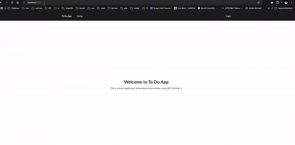

# To-Do App
# Vue 3 + Vite

[go-todolist-api](https://github.com/adipras/go-todolist-api) Clone repository backend using golang.


## Demo




## Build Setup

``` bash
# install dependencies
npm install

# serve with hot reload at localhost:8080
npm run dev

# build for production with minification
npm run build

# build for production and view the bundle analyzer report
npm run build --report
```
